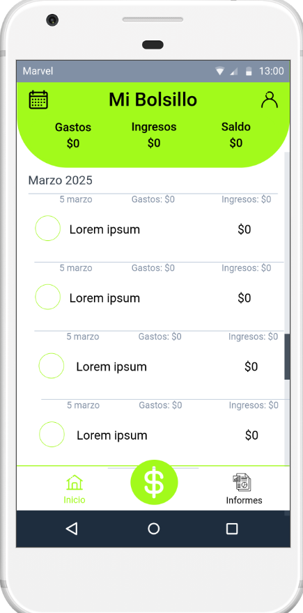
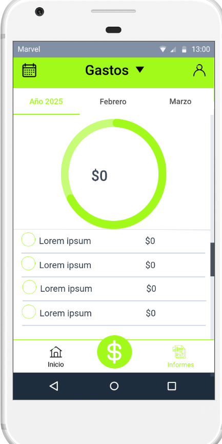

# Diseño de interfaz de usuario

La interfaz de usuario de la aplicación Mi Bolsillo está diseñada para ser sencilla, clara y accesible, permitiendo una navegación fluida y rápida. Se utilizan colores neutros con acentos vibrantes para resaltar la información financiera clave.

El diseño completo interactivo de Mi Bolsillo está disponible en [Marvel App](https://marvelapp.com/prototype/33h977e6)

A continuación, se presentan las principales pantallas:

1. Pantalla de inicio

El usuario podrá visualizar un resumen de sus finanzas, incluyendo ingresos, gastos y balance general. También podrá acceder rápidamente a otras funciones clave de la app.

1. Pantalla de informes

Desde esta pantalla, el usuario podrá acceder a un resumen visual y detallado de su situación financiera. La información se presenta mediante gráficos y estadísticas que facilitan el análisis de ingresos y gastos.

1. Pantalla de Agregar Gastos/Ingresos

Desde esta pantalla, el usuario podrá registrar nuevas transacciones de manera rápida y sencilla, ya sea un gasto o un ingreso. La interfaz es clara y accesible, permitiendo una gestión eficiente de las finanzas personales.

